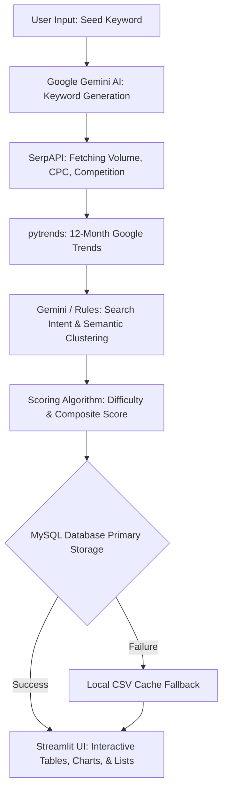

<div align="center">
  <h1>🔑 KeyLytics</h1>
  <p><strong>AI Powered SEO Keyword Research Platform</strong></p>

  
  
  
  
  
</div>


KeyLytics is a full-stack, state-of-the-art SEO keyword research and competitive analysis platform designed to supercharge organic search strategies. Built with Streamlit, Google Gemini AI, and SerpAPI, the platform consolidates search engine result page (SERP) scraping, keyword metric discovery, competitor gap mapping, semantic topic clustering, and historical trend forecasting into a single, unified workflow. It caters to digital marketers, SEO specialists, and content strategists who need deep, data-driven insights to outrank competitors and capture high-intent search traffic.

---

## Why This Project Exists

Manual SEO keyword research is a slow, fragmented, and expensive process. Specialists typically bounce between multiple premium tools—one for keyword generation, another for SERP features, and a third for search trends and keyword clustering—resulting in high licensing costs and disconnected data. 

Keylytics solves this workflow friction by centralizing the entire process. By combining Google Gemini's advanced semantic intelligence with SerpAPI's real-time Google search metrics and Google Trends data, Keylytics provides automated keyword discovery, intent classification, competitor mapping, and difficulty scoring in one premium, interactive platform.

---

## Key Features

1. **AI Keyword Discovery (Quick & Comprehensive Modes)**
   - Leverages Google Gemini to generate semantically relevant keywords from a single seed phrase.
   - **What the user gets:** A list of 5 (Quick), 15 (Standard), 30 (Full), or 50 (Comprehensive) high-potential SEO keyword suggestions.

2. **Composite SEO Scoring**
   - Combines search volume, CPC, and competition density into a unified scoring algorithm.
   - **What the user gets:** A proprietary composite score (0-100) highlighting the balance between high traffic potential and ease of ranking.

3. **Search Intent Classification**
   - A hybrid classification pipeline that uses fast pattern-matching rules and falls back on Gemini AI.
   - **What the user gets:** Keywords automatically categorized as *Informational*, *Commercial*, *Transactional*, or *Navigational*.

4. **Keyword Difficulty Rating**
   - Automatically determines difficulty levels based on search metrics and competitive density.
   - **What the user gets:** Visual difficulty badge ratings (*Easy*, *Medium*, *Hard*) for every keyword opportunity.

5. **Google Trends Integration**
   - Integrates Google Trends via `pytrends` with local MySQL DB caching to minimize rate limits.
   - **What the user gets:** 12-month historical interest profiles mapped directly onto keywords.

6. **Competitor Gap Analysis**
   - Fetches search results for top keywords to discover who is ranking, generating a semantic gap analysis.
   - **What the user gets:** A side-by-side gap score showing ranking opportunities against top competitor domains.

7. **Semantic Topic Clustering**
   - Semantic grouping powered by Gemini that organizes keywords into 3-8 topical clusters.
   - **What the user gets:** Aggregated metrics (total volume, average CPC, opportunity scores) grouped by sub-topic.

8. **6-Month Trend Forecasting**
   - Uses linear regression and seasonal pattern analysis to project keyword interest forward.
   - **What the user gets:** A line chart showing 6-month projected trend direction and identified seasonal peak months.

9. **SERP Analysis**
   - Detailed scanning of the search engine results pages including snippet detection and question extraction.
   - **What the user gets:** Featured snippet indicators, People Also Ask (PAA) questions, title/meta length checks, and ranked content suggestions.

10. **MySQL Persistence**
    - Seamless MySQL integration with connection pooling and an automatic local CSV fallback.
    - **What the user gets:** Safe data persistence with the guarantee that results are saved even if the database is offline.

11. **Multi-Model Gemini Fallback Chain**
    - An automated failover pipeline running across 5 Gemini/Gemma models.
    - **What the user gets:** High application uptime even under heavy API quotas or transient error blocks.

12. **Search History with Filters**
    - Stores previous runs and search inputs for immediate retrieval and comparison.
    - **What the user gets:** An interactive archive of previous keyword analyses sortable by volume, score, and difficulty.

13. **Interactive Charts**
    - Dynamic visualizations rendered natively through Plotly.
    - **What the user gets:** Interactive scatter plots, volume bar charts, intent pie charts, and trend line charts.

14. **CSV Export**
    - Generates downloadable CSV exports for all analysis views.
    - **What the user gets:** Clean, spreadsheet-ready CSV files containing keyword lists, metrics, intent, and competitor domains.

---

## Architecture

Keylytics is built on a modular three-tier structure designed for performance, resilience, and rapid iteration.

### Three-Tier Structure
* **Presentation Layer**: Streamlit (`app.py`) manages the stateful user interface, custom CSS styling, dynamic page routing, interactive Plotly visualizations, and frontend caching layers.
* **Business Logic Layer**: Located in the `src/` modules, this layer contains independent agents (`agent.py`, `lightweight_agent.py`), analyzers, classifiers, and forecasters processing keyword discovery, Google Trends, competitor gap rankings, and SERP data.
* **Data Layer**: A dual-persistence cache tier. MySQL serves as the primary relational database. When MySQL is unreachable, the system automatically falls back to saving and loading local CSV data in the `cache/` directory.

### Caching Strategy
To maintain low response latency and stay within API rate limits, the system operates three caching layers:
1. **Layer 1: MySQL DB Cache**: Stores SerpAPI metrics and Google Trends data with a 7-day Time-To-Live (TTL). Caches Gemini intent classifications permanently since intents remain stable.
2. **Layer 2: Streamlit In-Memory Cache**: Uses `@st.cache_data` with fine-tuned TTLs (e.g., 300s for API statuses, 1800s for analysis results, 3600s for database schema verification) to prevent redundant data reprocessing during page re-renders.
3. **Layer 3: CSV Caching**: Writes results to the `cache/` directory in CSV format if connection to the database fails, serving as a resilient local data store.

### AI Fallback Chain
Due to API quota limits and safety filters, Google Gemini calls run through an automatic failover chain across 5 models in this exact sequence:
1. `gemma-4-31b-it`
2. `gemma-4-26b-a4b-it`
3. `gemini-3.1-flash-lite`
4. `gemini-2.5-flash-lite`
5. `gemini-3.5-flash`
6. `gemini-3-flash-preview`
7. `gemini-2.5-flash`

If a model returns a 429 quota exception, the client pauses, backs off, and escalates to the next model in the chain. If a safety block is encountered, it skips directly to the next model. If all models fail, a rule-based fallback generator provides default keywords and intent labels to prevent application crashes.

### Data Flow



---

## Tech Stack

| Technology | Purpose | Why Chosen |
| :--- | :--- | :--- |
| **Streamlit** | Frontend + Backend Server | Rapid Python-native UI development, interactive components, built-in session state management. |
| **Google Gemini AI** | Semantic Intelligence | Industry-leading generative AI models with generous free-tier quotas and high semantic reasoning. |
| **SerpAPI** | Search Engine Scraping | Provides structured, clean, and reliable Google SERP data, avoiding browser automation overhead. |
| **pytrends** | Google Trends Data | Free, pythonic library to interface with Google Trends for raw historical interest metrics. |
| **SQLAlchemy + MySQL**| Data Persistence & ORM | Production-grade ORM providing connection pooling, strict type safety, and fast relational queries. |
| **Plotly** | Data Visualization | Renders beautiful, interactive, and responsive visualizations natively in Streamlit. |
| **pandas** | Tabular Data Processing | High-performance manipulation of structured keyword datasets, data cleaning, and CSV exports. |
| **python-dotenv** | Secrets Management | Securely separates configuration from the source code, reading API keys and credentials from `.env`. |
| **ThreadPoolExecutor**| Concurrency | Parallelizes SerpAPI and pytrends requests for multiple keywords to dramatically cut execution times. |

---

## Engineering Decisions

1. **Multi-Model Gemini Fallback**: Rather than relying on a single Gemini API model that could fail due to rate limits (429) or regional outages, the system utilizes a priority-based model list. It automatically falls back to the next available model, ensuring high availability.
2. **Two-Agent Design**: Built with a split-architecture: `lightweight_agent.py` for Quick Mode (5 keywords, ~10 seconds) and `agent.py` for Comprehensive Mode (up to 50 keywords, ~2 minutes). This lets the user choose between instant feedback and deep-dive strategic analysis.
3. **Resilient CSV Fallback**: Designed to handle MySQL connection failures gracefully. If the MySQL server is unreachable, the system transparently switches to file-based cache logs in the `cache/` folder, meaning local developer runs require zero database setup.
4. **Weighted Scoring Formula**: Implements a balanced SEO opportunity formula combining Search Volume ($60\%$), Competition Density ($30\%$), and Cost-Per-Click ($10\%$). This helps identify "low-hanging fruit" keywords with solid traffic and lower competition.
5. **Concurrent API Requests**: Uses `ThreadPoolExecutor` with a default of 8 concurrent workers during the comprehensive keyword processing step. This prevents sequential blocking and speeds up bulk analysis by up to $8\times$.
6. **Granular Streamlit Caching Tiers**: Configures different cache lifetimes depending on how frequently the source data changes: 5 minutes for API statuses, 30 minutes for SerpAPI/Gemini outputs, and 60 minutes for schema confirmations.

---

## AI Components

1. **Keyword Generation** (`gemini_client.py`): Uses prompt engineering to guide Gemini to output exactly 50 target keywords matching search patterns based on the seed topic. The model outputs structured, comma-separated keywords, which are cleaned and parsed programmatically.
2. **Search Intent Classification** (`intent_classifier.py`): Minimizes Gemini API token usage by employing a hybrid approach: keyword pattern matching rules classify straightforward queries (e.g., matching "buy", "how to") for free, while Gemini is invoked only for ambiguous phrases. Classified intents are cached in the `intent_cache` table.
3. **Semantic Topic Clustering** (`topic_clusterer.py`): Prompts Gemini to return a structured JSON mapping grouping keywords into 3 to 8 semantic silos. If the JSON is malformed or Gemini fails, the system falls back to a rule-based word-matching clustering algorithm.
4. **Competitor Gap Analysis** (`competitor_gap_analyzer.py`): Gemini is prompted to generate 15 related comparison keywords, and SerpAPI queries the actual organic listings for each keyword to check rankings for the user's input competitors.
5. **Content Ideas Generation** (`serp_analyzer.py`): Takes PAA (People Also Ask) questions scraped from SERPs and feeds them to Gemini to output actionable content outlines and optimization suggestions.

---

## Database Design

Keylytics uses a MySQL schema consisting of two primary tables to persist keyword data and cache classifications.

### Table: `keywords`
Stores scraped SEO metrics, computed scores, competitor lists, and serves as the primary cache layer for keyword metric queries.

```sql
CREATE TABLE IF NOT EXISTS keywords (
    id INT AUTO_INCREMENT PRIMARY KEY,
    seed VARCHAR(255),
    keyword VARCHAR(255) UNIQUE,
    volume INT,
    competition FLOAT,
    cpc FLOAT,
    trend INT,
    score FLOAT,
    difficulty VARCHAR(50),
    intent VARCHAR(100),
    competitors TEXT,
    last_updated TIMESTAMP DEFAULT CURRENT_TIMESTAMP ON UPDATE CURRENT_TIMESTAMP
);
```

* **Purpose**: Primary keyword metrics and competitor cache. Checked against `last_updated` to enforce a 7-day TTL.

### Table: `intent_cache`
Persists keyword search intent classifications to completely eliminate repeated LLM API calls for identical terms.

```sql
CREATE TABLE IF NOT EXISTS intent_cache (
    keyword VARCHAR(255) PRIMARY KEY,
    intent VARCHAR(100),
    last_updated TIMESTAMP DEFAULT CURRENT_TIMESTAMP ON UPDATE CURRENT_TIMESTAMP
);
```

* **Purpose**: Permanent cache storage for search intent labels.

---

## User Flow

1. **Access Application**: The user opens their browser to `http://localhost:8501`.
2. **Dashboard Overview**: The landing dashboard displays global metrics including total keywords analyzed, average search volume, and system API connection statuses in the sidebar.
3. **Navigation**: User selects **Keyword Discovery** in the sidebar.
4. **Search Configuration**: The user inputs a seed phrase (e.g., "AI tools") and configures the discovery mode (Quick, Standard, Full, or Comprehensive).
5. **Discovery Execution**: The user clicks **Analyze**. The system requests keyword variations from Gemini, then processes each keyword concurrently (SerpAPI for volumes, `pytrends` for interest trends, rules + Gemini for intent).
6. **Result Display**: Renders a comprehensive results table alongside interactive Plotly charts representing keyword difficulty distribution, intent ratios, and search volume rankings.
7. **Database Persistence**: The computed keyword metrics are saved to the MySQL database (or cached locally to CSV if the database is offline).
8. **Export**: The user filters results by volume or difficulty and downloads the final analysis as a CSV spreadsheet.

---

## Folder Structure

```text
keylytics-ai/
├── app.py                          # Main Streamlit application: UI, pages, caching
├── src/
│   ├── __init__.py                 # Package marker
│   ├── agent.py                    # Comprehensive analysis coordinator (high volume)
│   ├── lightweight_agent.py        # Light keyword discovery agent (low latency)
│   ├── gemini_client.py            # Gemini model interfaces & multi-model fallback chain
│   ├── seo_api_client.py           # SerpAPI client & MySQL cached metric storage
│   ├── db_client.py                # Database connection, schemas, and fallbacks
│   ├── trends_client.py            # Google Trends pyTrends connector & caching
│   ├── competitor_client.py        # Organic competitor rank extractor
│   ├── competitor_gap_analyzer.py  # Competitor gap score calculator
│   ├── serp_analyzer.py            # Snippet detection, PAA extraction, and optimization
│   ├── topic_clusterer.py          # Semantic clustering module
│   ├── trend_forecaster.py         # Seasonal analysis & 6-month forecaster
│   ├── intent_classifier.py        # Hybrid search intent classifier
│   └── scoring.py                  # SEO composite scoring calculations
├── cache/                          # Auto-created fallback CSV cache directory
├── requirements.txt                # Python package dependencies
├── .env                            # API keys and DB credentials (git-ignored)
├── .gitignore                      # Git exclusion rules
└── README.md                       # Product documentation
```

---

## Installation Guide

### Prerequisites
* **Python**: Python 3.8 or higher.
* **MySQL**: MySQL 8.0 or higher (optional, app operates in CSV-fallback mode without it).

### Setup Steps
1. **Clone the Repository**:
   ```bash
   git clone <repository-url>
   cd KeyLytics
   ```

2. **Create a Virtual Environment**:
   ```bash
   python -m venv venv
   ```

3. **Activate the Virtual Environment**:
   - **Windows**:
     ```powershell
     venv\Scripts\activate
     ```
   - **macOS/Linux**:
     ```bash
     source venv/bin/activate
     ```

4. **Install Dependencies**:
   ```bash
   pip install -r requirements.txt
   ```

5. **Configure Environment Variables**:
   Create a `.env` file in the root directory:
   ```env
   GEMINI_API_KEY=your_gemini_api_key
   SERPAPI_KEY=your_serpapi_key
   MYSQL_HOST=127.0.0.1
   MYSQL_USER=root
   MYSQL_PASSWORD=your_mysql_password
   MYSQL_DATABASE=keylytics_ai
   MYSQL_PORT=3306
   ```

6. **Initialize the MySQL Database (Optional)**:
   Connect to your MySQL server and run:
   ```sql
   CREATE DATABASE IF NOT EXISTS keylytics_ai;
   ```
   *Note: Keylytics verifies and creates the tables (`keywords` and `intent_cache`) automatically on startup.*

7. **Start the Application**:
   ```bash
   streamlit run app.py
   ```

---

## Environment Variables

| Variable | Required | Description | Default | Example |
| :--- | :--- | :--- | :--- | :--- |
| `GEMINI_API_KEY` | **Yes** | Google AI Studio developer credential | *None* | `AIzaSy...` |
| `SERPAPI_KEY` | **Yes** | SerpAPI search engine scraping credential | *None* | `abc123xyz...` |
| `MYSQL_HOST` | No | Host address of MySQL server | `127.0.0.1` | `localhost` |
| `MYSQL_USER` | No | Username for MySQL database authentication | `root` | `admin` |
| `MYSQL_PASSWORD` | No | Password for MySQL database authentication | *Empty* | `MySecurePass123` |
| `MYSQL_DATABASE` | No | Relational database schema name | `keylytics_ai`| `keylytics_prod` |
| `MYSQL_PORT` | No | Port number on which MySQL listens | `3306` | `3306` |

---

## Running The Project

### Local Development
```bash
streamlit run app.py
```

### Development Debug Mode
Enables verbose debug printing and logging output to the terminal:
```bash
streamlit run app.py --logger.level debug
```

### Specifying Custom Ports
Runs the Streamlit server on a defined port:
```bash
streamlit run app.py --server.port 8502
```

### Database-Free Mode (CSV Fallback)
If you do not have MySQL installed, leave the `MYSQL_*` variables commented out or empty in your `.env`. Keylytics will automatically route all data storage and retrieval to `.csv` files stored under the `/cache` folder.

---

## Deployment Guide

### Option 1: Streamlit Community Cloud (Free Hosting)
1. Push your code to a private or public GitHub repository. Ensure `.env` is listed in your `.gitignore` and not committed.
2. Sign in to [Streamlit Community Cloud](https://share.streamlit.io/).
3. Click **New App**, select your repository, branch, and set `app.py` as the main entry point.
4. Open the **App Settings** and navigate to the **Secrets** section. Add your credentials:
   ```toml
   GEMINI_API_KEY = "your_gemini_key"
   SERPAPI_KEY = "your_serpapi_key"
   ```
5. Deploy. *Note: Streamlit Community Cloud instances do not support persistent MySQL connections by default; the app will utilize local CSV cache fallback.*

### Option 2: Railway or Render (Containerized Cloud Hosting)
1. Deploy from your GitHub repository.
2. Provision a **MySQL Database Add-on** in your project dashboard.
3. Bind the connection variables from the MySQL database directly to your service:
   - `MYSQL_HOST`
   - `MYSQL_PORT`
   - `MYSQL_USER`
   - `MYSQL_PASSWORD`
   - `MYSQL_DATABASE`
4. Define your `GEMINI_API_KEY` and `SERPAPI_KEY` environment variables.
5. Railway/Render will automatically build and start the Streamlit server using `requirements.txt`.

### Option 3: Self-Hosted VPS (Nginx + Systemd)
1. Install Python 3.8+ and MySQL 8.0+ on your virtual server (e.g., Ubuntu).
2. Clone the repository to `/var/www/keylytics-ai` and set up the virtual environment.
3. Configure a systemd service file `/etc/systemd/system/keylytics.service`:
   ```ini
   [Unit]
   Description=Keylytics Streamlit App
   After=network.target

   [Service]
   User=www-data
   WorkingDirectory=/var/www/keylytics-ai
   EnvironmentFile=/var/www/keylytics-ai/.env
   ExecStart=/var/www/keylytics-ai/venv/bin/streamlit run app.py --server.port 8501 --server.address 0.0.0.0

   [Install]
   WantedBy=multi-user.target
   ```
4. Start and enable the service: `systemctl enable --now keylytics`.
5. Point Nginx to reverse proxy port `8501` to serve the application on your custom domain with SSL (using Let's Encrypt).

---

## Screenshots Section

> Screenshots coming soon. 
> Key screens: Home Dashboard, Keyword Discovery Results, Competitor Gap Analysis, Topic Clustering, Trend Forecasting, SERP Analysis.

---

## Performance Considerations

* **Parallel Metric Scraping**: Utilizes `ThreadPoolExecutor` with 8 parallel worker threads. The app fetches metrics for up to 50 keywords simultaneously, avoiding linear network blocking and speeding up API operations.
* **SerpAPI / Google Trends Cache TTL**: Search metrics and Google Trends results are cached locally in the database. Redundant requests for identical terms within a 7-day window are resolved instantly from the cache, reducing API consumption.
* **Intent Caching**: Search intent classification results are stored permanently. Since intent rarely changes over time, this prevents unnecessary LLM API calls and keeps costs low.
* **Streamlit Session State**: Keeps visual results and tab states inside memory, avoiding page reload queries when switching tabs.
* **Incremental Writes**: Saves progress directly to files during processing steps to prevent data loss in the middle of long-running keyword discovery sessions.

---

## Security Considerations

1. **Secrets Separation**: API keys and database login credentials are loaded using `.env` files, which are strictly blacklisted from version control in `.gitignore`.
2. **SQL Injection Protection**: All database queries are executed using SQLAlchemy parameterized statements (`text("SELECT ... WHERE keyword = :kw")`), rendering SQL injections impossible.
3. **Password URL Encoding**: Database passwords containing special characters (e.g., `@`, `/`, `:`) are encoded via `urllib.parse.quote_plus` before generating connection strings, preventing backend connection errors.
4. **Input Sanitization**: Validates keyword strings and search inputs. Limits search queries to standard string lengths to prevent buffer overflows or malformed API requests.
5. **Error Containment**: Errors encountered in database operations or external API failures are logged internally; friendly status alerts are displayed to users in the UI instead of exposing technical stack traces.

---

## Challenges Solved

1. **Gemini Quota Management (429 Rate Limits)**: Bulk queries easily hit limits. Resolved by building a fallback chain that tries alternative models automatically.
2. **Pytrends Google Blocking**: Google Trends implements strict rate limits. Solved with a connection loop featuring exponential backoff ($2^{\text{attempt}} \times 3\text{ seconds}$), random sleep jitter, and database cache lookups to minimize hits.
3. **Database Portability / Zero-Config Setup**: Addressed the requirement for local runs without a database by building a transparent fallback client. If SQLAlchemy cannot establish a connection pool, the data layer intercepts the error and routes actions to a CSV store.
4. **Streamlit Component Re-rendering**: Streamlit's architecture re-runs scripts top-to-bottom on every user action. Solved using `@st.cache_data` decorators with carefully configured timeouts to preserve transient dashboard results.
5. **Slow API Processing**: Sequential execution for 50 keywords across multiple APIs took up to 5 minutes. Reduced processing time to ~25 seconds by implementing concurrent worker threads via `ThreadPoolExecutor`.
6. **Gemini Formatting Failures**: LLM outputs often contain markdown wrappers (e.g., ` ```json `). Resolved by implementing regex-based cleaner scripts that parse raw text fallback dictionaries when JSON formats fail.

---

## License

This project is licensed under the terms of the MIT License.
